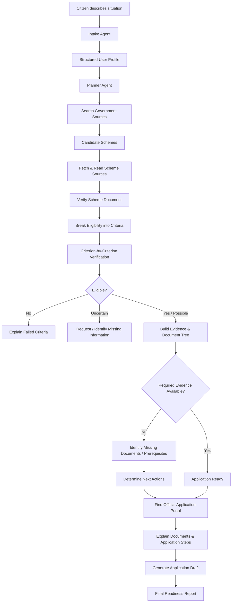
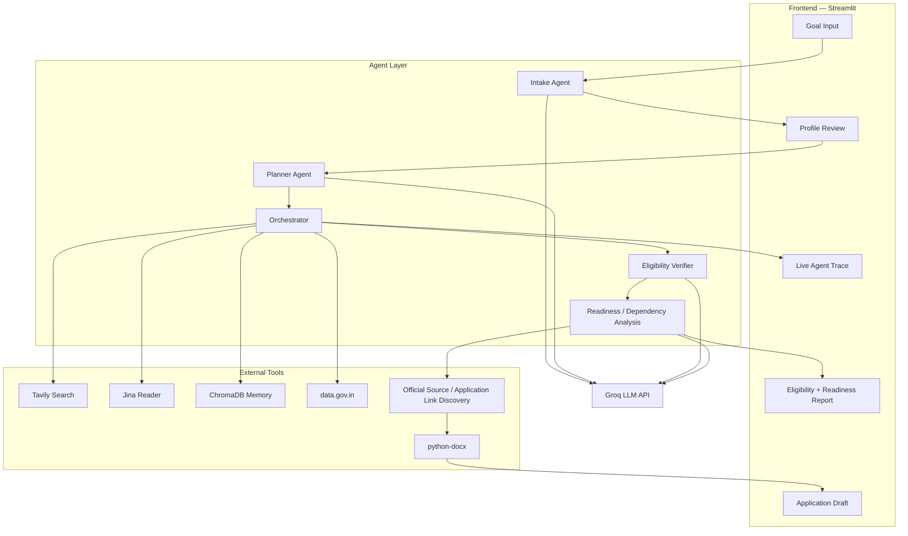

### Project - CivicPilot
## Team name - CivicExperts
## Team members
Aibel Bejoy - S3 CS DS
Merin Joy - S5 CS C
Sijil - S3 CS DS
# CivicPilot — From Eligibility to Application Readiness

CivicPilot is an **agentic AI welfare-navigation system** for Indian citizens. A user describes their situation in plain language, and CivicPilot autonomously discovers relevant government welfare schemes, verifies eligibility against authoritative criteria, traces the evidence and document requirements needed to prove that eligibility, identifies prerequisites, finds the official application portal, and prepares a structured application draft.

The key idea is to go beyond **"Which schemes am I eligible for?"** and answer:

> **"Am I actually ready to apply, what is missing, and what do I need to do next?"**

---

## 1. Problem Statement

Thousands of Indian government welfare schemes exist across departments and portals, but citizens often struggle to:

- find schemes relevant to their situation;
- understand dense eligibility rules and administrative terminology;
- determine whether they actually satisfy every criterion;
- know what documents or evidence prove each criterion;
- understand prerequisite certificates or government services;
- find the correct official application portal; and
- know what to do with the documents they have gathered.

A conventional chatbot may simply say **"you are eligible"** without showing how that conclusion was reached.

The deeper gap is:

**Eligibility ≠ Application Readiness**

A citizen can qualify for a scheme and still be unable to apply because required evidence, documents, prerequisites, or the correct application route are missing.

---

## 2. Solution

CivicPilot acts as an **autonomous welfare-navigation agent**.

The user provides their situation once in plain language. The agent then:

1. discovers relevant schemes from government sources;
2. breaks the selected scheme into individual eligibility criteria;
3. checks each criterion against the user's information;
4. links each decision to supporting government evidence;
5. identifies missing or uncertain information;
6. builds a document/evidence dependency tree;
7. identifies prerequisite certificates or services;
8. determines whether the citizen is application-ready;
9. finds the official application portal;
10. explains what information/documents need to be used there; and
11. generates a structured application draft for the user to review.

The agent does **not** submit applications on behalf of the citizen. The final submission remains on the official government portal.

---

## 3. What the User Gets

For each relevant scheme, CivicPilot provides:

### Eligibility

- PASS / FAIL / UNCERTAIN for individual criteria
- reason for each decision
- quoted supporting text from the source
- source link for verification

### Application Readiness

- eligible / not eligible / insufficient information
- documents already available
- missing documents
- missing evidence
- prerequisite services or certificates
- recommended order of actions

### Application

- official application portal/link
- explanation of what to prepare before opening it
- structured application draft (`.docx`)

### Example

```text
Scheme: Student Scholarship

Eligibility
✓ Age requirement
✓ Income requirement
✓ Residence requirement
? Institution requirement

Evidence
✓ Marksheet
✓ Residence proof
✗ Income certificate

Prerequisite
→ Obtain income certificate

Readiness
→ Eligible, but NOT YET APPLICATION-READY

Next step
→ Obtain income certificate
→ Return to scholarship application

Official portal
→ [Verified government application link]
```

---

## 4. Key Features

### 4.1 Natural-language citizen intake
Users describe their situation without knowing government terminology.

### 4.2 Autonomous scheme discovery
The agent dynamically searches government sources instead of relying on a hardcoded scheme list.

### 4.3 Criterion-by-criterion verification
Eligibility is decomposed into individual conditions rather than producing a single yes/no prediction.

### 4.4 Evidence-backed decisions
Each criterion includes supporting source text and a source URL.

### 4.5 Uncertainty handling
The system can explicitly return:

- `PASS`
- `FAIL`
- `UNCERTAIN`

It does not guess missing information.

### 4.6 Eligibility Evidence Matrix
The system maps:

**Government criterion → User information → Evidence → Result**

### 4.7 Document and prerequisite tree
For each unmet requirement, CivicPilot traces what evidence/document is needed and, where possible, what prerequisite service or document is needed to obtain it.

### 4.8 Application-readiness assessment
The system distinguishes between:

**Eligible** and **Ready to Apply**

### 4.9 Official application route
CivicPilot identifies the official application portal rather than leaving the user to search independently.

### 4.10 Application guidance
The user receives an explanation of what documents and information should be prepared for the application.

### 4.11 Application draft
A downloadable `.docx` draft is generated for the top recommended/possible scheme.

### 4.12 Agent execution trace
The UI exposes planning, tool calls, verification, decisions, and final output for transparency.

### 4.13 Session memory
ChromaDB caches retrieved scheme information within the session to reduce repeated fetching.

---

## 5. Agent Workflow / Flowchart



### Agent execution pattern

```text
Plan → Search → Observe → Verify → Identify Dependencies
→ Replan if required → Prepare → Report
```

---

## 6. Agent Architecture

CivicPilot uses specialized LLM-powered steps coordinated by a custom Python orchestrator.



### Agent responsibilities

| Agent / Component | Responsibility |
|---|---|
| **Intake Agent** | Converts natural-language situation into a structured citizen profile |
| **Planner Agent** | Breaks the goal into executable research and verification tasks |
| **Orchestrator** | Executes the plan, calls tools, maintains state, and coordinates steps |
| **Eligibility Verifier** | Compares scheme criteria with the citizen profile and source text |
| **Readiness / Dependency Layer** | Determines missing evidence, documents, prerequisites and application readiness |
| **Source Tools** | Retrieve and inspect government information |
| **Document Generator** | Produces the application draft |

---

## 7. Tech Stack

### Frontend

- **Streamlit ≥ 1.37**
- Single-page UI
- `st.session_state` for phase/state management
- Live `TraceEvent` progress display
- Markdown eligibility/readiness report
- `.docx` download

### Backend

There is no separate FastAPI/Django/Node server.

The backend is the **Python agent runtime**:

- Python 3.9+
- Custom orchestration generator
- `python-dotenv`
- `requests`
- temporary file storage for generated documents

### AI / LLM

**Groq API**

Task-based model routing:

| Task | Model |
|---|---|
| Complex reasoning / planning / verification | `openai/gpt-oss-120b` |
| Simple profile extraction | `openai/gpt-oss-20b` |
| Safeguard document classification | `openai/gpt-oss-safeguard-20b` |

LLM features:

- function calling for structured output
- streaming generation
- retry with exponential backoff
- model fallback on rate limits

### Agent Framework

**Custom Python agent orchestration**

No LangChain or LangGraph is used.

The orchestrator implements:

**Plan → Act → Observe → Verify → Replan → Report**

### Tools / APIs

| Tool | Purpose |
|---|---|
| **Tavily** | Search for relevant government schemes and official sources |
| **Jina AI Reader** | Fetch and parse web pages/PDF-linked content |
| **data.gov.in API** | Optional official open-data cross-reference |
| **ChromaDB** | Session-level semantic memory/cache |
| **python-docx** | Generate application drafts |
| **Groq API** | LLM inference |

Search is scoped toward official government sources, including `.gov.in` and relevant government scheme portals.

### Database / Memory

**ChromaDB**

- `EphemeralClient`
- in-process session memory
- `all-MiniLM-L6-v2` embeddings
- similarity-based caching of previously retrieved scheme information

No external database is required for the current MVP.

---

## 8. Current Agent State / Data Models

### `UserProfile`

```text
age
gender
occupation
income_annual_inr
income_description
location_state
location_type
category
disability_status
special_status
family_size
education_level
stated_need
raw_goal
```

### `VerificationResult`

```text
scheme_name
source_url
overall
confidence
verified_against_official
criteria_checks[]
rejection_reason
note
```

### `CriterionCheck`

```text
criterion
status        # PASS | FAIL | UNCERTAIN
reason
quoted_text
```

### Extended readiness state

```text
eligibility_status
evidence_available[]
missing_information[]
required_documents[]
missing_documents[]
prerequisites[]
next_actions[]
official_application_url
application_readiness
```

---

## 9. How the Agent Handles a Scheme

For a selected scheme, the agent follows a decision-tree style process:

```text
Scheme
  │
  ├── Criterion 1
  │     └── What evidence proves it?
  │             └── Is evidence available?
  │
  ├── Criterion 2
  │     └── What document proves it?
  │             └── Is document available?
  │
  ├── Criterion 3
  │     └── Is another certificate required?
  │             └── What is needed to obtain it?
  │
  └── Final readiness
          ├── Ready
          └── Missing requirements
                  ↓
             Next actions
                  ↓
        Official application portal
```

This turns a dense scheme guideline into an actionable path for the citizen.

---

## 10. Project Structure

```text
agentic-ai/
├── app.py
├── requirements.txt
├── .env.example
├── README.md
└── agent/
    ├── groq_client.py
    ├── intake.py
    ├── planner.py
    ├── orchestrator.py
    ├── verifier.py
    └── tools/
        ├── tavily_search.py
        ├── jina_reader.py
        ├── memory.py
        ├── datagov.py
        └── doc_generator.py
```

The readiness/dependency layer can be implemented as an extension of the planner/orchestrator/verifier pipeline without requiring a separate backend.

---

## 11. Setup / How to Run

### Prerequisites

- Python 3.9+
- Groq API key
- Tavily API key
- Optional: data.gov.in API key

### Install

```bash
git clone <repository-url>
cd agentic-ai

pip install -r requirements.txt
```

### Configure environment

```bash
cp .env.example .env
```

Add:

```env
GROQ_API_KEY=your_groq_key
TAVILY_API_KEY=your_tavily_key
DATA_GOV_IN_API_KEY=your_optional_key
```

### Run

```bash
streamlit run app.py
```

The application will normally be available at:

```text
http://localhost:8501
```

### Important

Do not commit `.env` or real API keys to the repository. Use `.env.example` only as a template.

---

## 12. Example User Journey

**User:**

> "I'm a 55-year-old widow with no income living in rural Kerala."

### CivicPilot

**Step 1 — Understand**

Extracts the citizen profile.

**Step 2 — Discover**

Searches government sources for potentially relevant welfare schemes.

**Step 3 — Verify**

Checks each candidate scheme criterion-by-criterion.

**Step 4 — Evidence**

Maps the criteria to the citizen's information and quoted government requirements.

**Step 5 — Readiness**

Determines which documents/evidence are already available and which are missing.

**Step 6 — Dependencies**

Identifies prerequisite certificates or services where applicable.

**Step 7 — Apply**

Finds the official application route and explains what should be prepared.

**Step 8 — Draft**

Generates a structured application draft.

---

## 13. Design Principles

1. **Plan and execute, not single-shot prompting**
2. **Source-grounded verification**
3. **No guessing missing user information**
4. **Explicit uncertainty**
5. **Criterion-level evidence**
6. **Eligibility is separate from application readiness**
7. **Official application routes**
8. **Human review before final submission**
9. **No hardcoded scheme-specific logic**
10. **Transparent agent trace**

---

## 14. Limitations

- India-specific for the current MVP.
- Government pages and scheme rules can change.
- Eligibility quality depends on the availability and clarity of authoritative source material.
- The system does not directly submit applications to government portals.
- Application drafts may leave personal fields blank for the user to complete.
- Current ChromaDB memory is session-level and ephemeral.
- Network calls and multiple LLM/tool steps can make a full run take several minutes.

---

## 15. Why It Is Agentic

CivicPilot is not simply a chatbot that retrieves schemes.

Given a high-level citizen goal, the system:

```text
Understand the situation
        ↓
Plan what needs to be found
        ↓
Search external sources
        ↓
Inspect candidate schemes
        ↓
Verify individual criteria
        ↓
Identify missing evidence
        ↓
Trace document/prerequisite dependencies
        ↓
Determine application readiness
        ↓
Find the official application route
        ↓
Generate the application draft
        ↓
Return a verifiable result
```

The agent therefore performs a **multi-step task with external tools, state, verification, and a concrete outcome** rather than returning a single LLM-generated answer.
