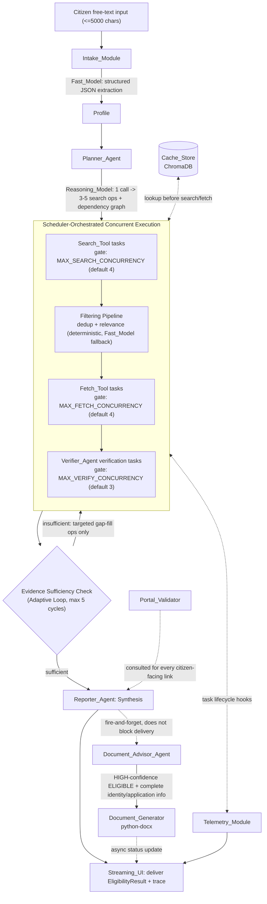
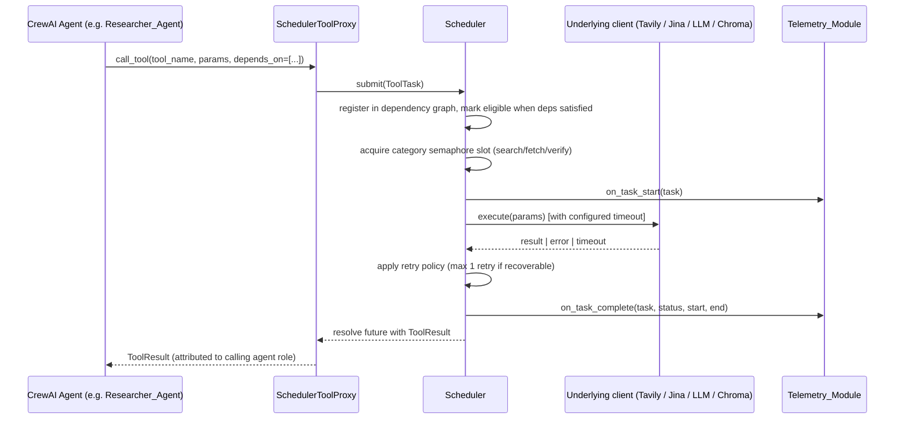

# Design Document

## Overview

CivicPilot is a Python backend system that helps Indian citizens discover and verify eligibility for government welfare schemes, built to resolve normal requests in 8-15s, complex requests in 15-25s, and degraded-dependency requests in no more than ~30s.

The system is implemented as five CrewAI agent roles (`Planner_Agent`, `Researcher_Agent`, `Verifier_Agent`, `Document_Advisor_Agent`, `Reporter_Agent`) that perform reasoning and attribute outputs to their role, but **none of these agents execute tools directly**. Every tool invocation — search, fetch, LLM call, cache lookup, portal validation, document generation — is submitted as a `ToolTask` to a custom async `Scheduler` built on `asyncio`. The Scheduler owns all concurrency, prioritization, dependency resolution, timeout enforcement, retry policy, cancellation, and failure isolation. CrewAI supplies the *role structure and reasoning*; the Scheduler supplies the *execution model*. This split is the central architectural decision of the system (Requirement 1) and is not revisited elsewhere in this design.

Supporting architectural decisions fixed by the requirements and treated as given:

- **Search**: Tavily via `Search_Tool`.
- **Fetch**: Jina Reader via `Fetch_Tool`.
- **Cache**: ChromaDB-backed `Cache_Store` (or a drop-in equivalent vector/KV store exposing the same interface).
- **Documents**: `python-docx`-backed `Document_Generator`.
- **LLM routing**: two provider-agnostic roles, `Fast_Model` and `Reasoning_Model`, configured entirely via `.env`.
- **Concurrency**: bounded per tool category (search / fetch / verify), configurable via `.env`, with operative defaults of 4 / 4 / 3 (Requirement 23). Requirement 9.3 separately illustrates a "default of 3" for search when describing the 1-5 valid range for that category; this design treats Requirement 23.1's `MAX_SEARCH_CONCURRENCY=4` as the canonical startup default (both values are within the 1-5 domain range, so no requirement is violated), and documents the discrepancy here rather than silently resolving it in code comments alone.
- **Telemetry**: per-stage timings, Critical_Path_Latency computed from real timestamps, tool/cache/concurrency counters.
- **Streaming UI**: reflects only real Scheduler/agent state transitions — never timer-based fake progress.

The system must generalize across arbitrary profiles and schemes (Requirement 22): the pipeline stages, reasoning engine, and Scheduler are identical for every request; only profile data, scheme configuration, and domain registries vary.

## Architecture

### Pipeline



### CrewAI role to Scheduler-task mapping

Every CrewAI agent tool is a thin `SchedulerToolProxy` — it never calls Tavily, Jina, ChromaDB, or an LLM endpoint itself. It builds a `ToolTask`, submits it to the Scheduler, and `await`s the Scheduler's result future. This is what makes Requirement 1.2 ("route all tool invocations ... through the Scheduler") and Requirement 1.5 (rejecting any direct invocation) enforceable: the proxy is the *only* code path CrewAI agents are given access to, and it is the sole caller permitted to reach the underlying tool clients.



If any component attempts to bypass the proxy (e.g., import a Tavily client directly), the architecture makes this observable and rejectable: the raw clients are only constructed inside the Scheduler's tool-executor registry and are not exported to agent-visible modules. A guard in the proxy layer (`_ARCHITECTURE_GUARD`) raises `ArchitectureViolationError` if invoked outside a registered agent context, satisfying Requirement 1.5.

### Adaptive loop

The "Adaptive loop" box in the pipeline is not a separate agent — it is a control-flow function (`assess_sufficiency`) invoked by the orchestrator after each research/verification wave. It inspects the current set of `EligibilityCriterion` evidence for every in-flight `SchemeCandidate` and either terminates the wave (sufficient) or emits a new, narrowly-targeted `ToolTask` batch addressing only the unresolved criteria (insufficient), bounded to 5 cycles per determination (Requirement 13.4).

## Components and Interfaces

### Scheduler

The Scheduler is the first-class execution engine (Requirement 2). It is deliberately independent of CrewAI's orchestration.

```python
class ToolCategory(str, Enum):
    SEARCH = "search"
    FETCH = "fetch"
    VERIFY = "verify"
    FAST_MODEL = "fast_model"
    REASONING_MODEL = "reasoning_model"
    PORTAL_VALIDATE = "portal_validate"
    DOCUMENT = "document"
    CACHE = "cache"          # deterministic, unscheduled, but counted for tool-budget telemetry

class TaskStatus(str, Enum):
    PENDING = "pending"
    ELIGIBLE = "eligible"
    RUNNING = "running"
    COMPLETED = "completed"
    FAILED = "failed"
    TIMED_OUT = "timed_out"
    CANCELLED = "cancelled"
    SKIPPED = "skipped"

@dataclass
class ToolTask:
    task_id: str
    category: ToolCategory
    tool_name: str
    params: dict[str, Any]
    priority: int                    # 1 (highest) .. 10 (lowest)
    timeout_ms: int                  # > 0
    depends_on: list[str]            # task_ids
    agent_role: str                  # which CrewAI role issued this
    status: TaskStatus = TaskStatus.PENDING
    retries_used: int = 0
    result: Any = None
    error: str | None = None
    started_at: float | None = None
    completed_at: float | None = None
    dependency_satisfied_at: float | None = None  # tie-break for equal priority

class Scheduler:
    def __init__(self, concurrency_limits: dict[ToolCategory, int], timeouts: TimeoutConfig,
                 telemetry: TelemetryModule) -> None: ...

    async def submit(self, task: ToolTask) -> asyncio.Future[ToolTask]:
        """Registers the task in the dependency graph and priority queue.
        Returns a future that resolves once the task reaches a terminal status."""

    async def cancel(self, task_id: str) -> None:
        """Cancels a pending or running task; sets status=cancelled."""

    async def run(self) -> None:
        """Main scheduling loop: for each ToolCategory, maintains a bounded
        asyncio.Semaphore(concurrency_limits[category]) and a priority
        heap of eligible tasks keyed by (priority, dependency_satisfied_at)."""
```

Design notes mapped to acceptance criteria:

- **Task model** (2.1): `ToolTask` fields exactly match `tool_name`, `params`, `priority` (1-10), `timeout_ms` (>0), `depends_on`.
- **Dependency graph** (2.2, 2.11): a task moves `PENDING -> ELIGIBLE` the instant every entry in `depends_on` reaches `COMPLETED`. If any dependency reaches `FAILED`, `TIMED_OUT`, or `CANCELLED`, the dependent task is marked `SKIPPED` without ever executing, and that skip propagates transitively to its own dependents.
- **Priority queue** (2.4): each category owns a binary heap ordered by `(priority, dependency_satisfied_at)` — lower priority number first, ties broken by earliest dependency-satisfaction timestamp (FIFO among equals).
- **Concurrency gates** (2.3, 23.5): one `asyncio.Semaphore` per `ToolCategory`, sized from `.env` (`MAX_SEARCH_CONCURRENCY`, `MAX_FETCH_CONCURRENCY`, `MAX_VERIFY_CONCURRENCY`). A task only leaves the queue when it both is `ELIGIBLE` and a semaphore slot is available; this is the sole gate on concurrent execution, so the limit can never be structurally exceeded.
- **Timeout/retry/cancellation** (2.5, 2.6, 2.9, 18.1-18.9): each execution is wrapped in `asyncio.wait_for(..., timeout=task.timeout_ms/1000)`. On `TimeoutError`, status becomes `TIMED_OUT` (no retry). On a tool-reported retryable error, the Scheduler retries exactly once with the same timeout, then marks `FAILED` if the retry also fails. Non-retryable errors go straight to `FAILED`. `cancel()` transitions `PENDING/RUNNING -> CANCELLED` and, for running tasks, cancels the underlying `asyncio.Task`.
- **Failure isolation** (2.7, 5.2, 19.1-19.2): failures are per-task `Future` rejections; the scheduling loop never awaits one task before dispatching sibling-eligible tasks, so a failure only affects tasks that declared a dependency on it.
- **Telemetry hooks** (2.8, 2.10, 4.6-4.8): `on_task_start`, `on_task_complete`, and `on_batch_complete(category, batch_size, batch_elapsed)` callbacks are invoked synchronously at each transition; `on_batch_complete` fires whenever the set of concurrently-running tasks in a category drains to zero, recording batch size and the first-start-to-last-finish elapsed time used for Critical_Path_Latency.

### Intake_Module

```python
class IntakeModule:
    def __init__(self, fast_model: ModelClient) -> None: ...

    async def extract_profile(self, raw_text: str) -> Profile:
        """Validates length/emptiness, issues one Fast_Model structured-JSON
        extraction call via the Scheduler (category=FAST_MODEL), and maps the
        parsed JSON onto Profile fields. Never fills a field the model did not
        explicitly ground in the input; unresolved fields stay None."""
```

- Rejects input that is empty, whitespace-only, or `> 5000` chars with `IntakeRejectionError` (7.2) — deterministic, no LLM call.
- Issues exactly one `ToolTask(category=FAST_MODEL, tool_name="extract_profile")` with a JSON-schema-constrained prompt (7.5).
- If the call fails or the returned text fails `json.loads` / schema validation, raises `ProfileExtractionError` and never returns a partial `Profile` (7.6).

### Planner_Agent

```python
class PlannerAgent:
    def __init__(self, reasoning_model: ModelClient, scheduler: Scheduler) -> None: ...

    async def plan(self, profile: Profile) -> SearchPlan:
        """Issues exactly one REASONING_MODEL ToolTask (timeout 30s per 8.3)
        that returns 3-5 distinct SearchOperations plus a dependency
        annotation between them. Validates count in [3,5] and pairwise
        distinctness; on any violation, discards the plan and raises
        PlanningFailure rather than truncating/padding it."""
```

`SearchPlan.operations` is submitted to the Scheduler as `ToolTask(category=SEARCH, depends_on=[... other search op ids the Planner marked as dependent ...])`, so independent operations are scheduled the moment they're eligible (8.4-8.6) and a failed operation never halts siblings (8.7).

### Researcher_Agent (Search_Tool + Fetch_Tool wrappers)

```python
class SearchToolProxy:
    async def search(self, query: str, *, priority: int, depends_on: list[str]) -> SearchResultSet:
        """Wraps Tavily. Always includes, across the issued query set, at
        least one site:myscheme.gov.in-scoped query (9.2). Submits via
        Scheduler(category=SEARCH, timeout=SEARCH_TIMEOUT_S)."""

class FetchToolProxy:
    async def fetch(self, url: str, *, priority: int, depends_on: list[str]) -> FetchedPage:
        """Wraps Jina Reader. Checks Cache_Store for an unexpired URL entry
        first (12.1); on miss, submits via
        Scheduler(category=FETCH, timeout=FETCH_TIMEOUT_S)."""

class ResearcherAgent:
    def __init__(self, search: SearchToolProxy, fetch: FetchToolProxy,
                 cache: CacheStore, filter_pipeline: FilterPipeline) -> None: ...

    async def research(self, profile: Profile, plan: SearchPlan) -> list[SchemeCandidate]:
        """Runs search wave -> FilterPipeline -> fetch wave, ranking sources
        per the 6-tier priority order in Requirement 9.5."""
```

`FilterPipeline` (Requirement 10) is a separate, mostly-deterministic component used by `ResearcherAgent`:

```python
class FilterPipeline:
    def dedupe(self, results: list[RawSearchResult]) -> list[RawSearchResult]:
        """Normalizes URLs (strip trailing slash, sort query params, force
        scheme-insensitive host) and drops exact-normalized duplicates. Pure,
        deterministic, no I/O (10.1)."""

    def remove_irrelevant(self, results: list[RawSearchResult], query: str) -> list[RawSearchResult]:
        """Deterministic term/topic-overlap check against title+snippet (10.2)."""

    async def classify_ambiguous(self, results: list[RawSearchResult], query: str) -> list[RawSearchResult]:
        """Only for results deterministic filtering could not decide;
        issues a FAST_MODEL ToolTask. On failure, retains the candidates
        unscored rather than dropping them (10.3-10.4)."""

    def rank_and_select(self, results: list[RawSearchResult]) -> list[RawSearchResult]:
        """Tier-ranks per Requirement 9.5 and returns top 5 (or fewer, down
        to 0, if fewer remain) (10.5)."""
```

### Cache_Store (ChromaDB schema)

```python
class CacheStore:
    def __init__(self, chroma_client: "chromadb.Client", collection_name: str = "civicpilot_cache") -> None: ...

    async def get(self, key: CacheKey) -> CacheEntry | None:
        """Looks up by exact key type (URL | SCHEME | PROFILE_CATEGORY).
        Returns None if absent or if now - entry.timestamp > 24h (12.6-12.7)."""

    async def put(self, key: CacheKey, entry: CacheEntry) -> None:
        """No-op (raises CachePersistenceError caught by caller as a no-op)
        if entry.status in {"partial", "failure"} (12.5)."""
```

ChromaDB collection layout — one collection, documents keyed by a composite id:

| Chroma field | Content |
|---|---|
| `id` | `f"{key.kind}:{key.identifier}"` (e.g. `url:https://...`, `scheme:pm-kisan`, `profile_category:farmer`) |
| `document` | JSON-serialized `content_payload` (embedded for semantic scheme/category lookups) |
| `metadata.timestamp` | ISO-8601 write time |
| `metadata.source_id` | originating tool/task id |
| `metadata.status` | `success` \| `partial` \| `failure` |
| `metadata.confidence` | float in `[0.0, 1.0]` |
| `metadata.key_kind` | `url` \| `scheme` \| `profile_category` |

Embeddings are only generated for `scheme` and `profile_category` entries (enabling semantic-similarity cache hits for near-duplicate category lookups); `url` entries use exact-key lookup only, since URL identity should not be fuzzy-matched.

### Verifier_Agent (criterion evaluation engine + evidence sufficiency check)

```python
class VerifierAgent:
    def __init__(self, reasoning_model: ModelClient, scheduler: Scheduler) -> None: ...

    async def evaluate_criterion(self, criterion: EligibilityCriterion, profile: Profile) -> EligibilityCriterion:
        """Deterministic path first: if criterion.comparator/threshold can be
        checked directly against a non-null Profile field, resolve PASS/FAIL
        without any model call (14.3-14.4). If the required field is null,
        classify UNKNOWN immediately -- never PASS. Otherwise escalate to a
        REASONING_MODEL ToolTask (category=VERIFY concurrency gate applies to
        the surrounding verification task, not the LLM call itself);
        any non-definitive/failed response classifies UNKNOWN (14.5)."""

    def derive_overall_result(self, criteria: list[EligibilityCriterion]) -> OverallEligibility:
        """ELIGIBLE iff all PASS; NOT_ELIGIBLE if any FAIL; else
        POSSIBLE_NEEDS_INFO (14.2). FAIL takes precedence over UNKNOWN."""

    def assess_sufficiency(self, candidates: list[SchemeCandidate]) -> SufficiencyReport:
        """Evidence is sufficient when every applicable criterion for a
        determination has resolved evidence and no unresolved conflict
        would change the outcome (13.1). Returns which criteria are still
        unresolved and what targeted ToolTasks (if any) would address them,
        respecting the 5-cycle cap (13.4)."""
```

### Document_Advisor_Agent

```python
class DocumentAdvisorAgent:
    def __init__(self, generator: "DocumentGenerator", scheduler: Scheduler) -> None: ...

    async def maybe_generate(self, result: EligibilityResult, candidate: SchemeCandidate) -> DocumentOutcome:
        """Gate: result.overall == ELIGIBLE and result.confidence_level ==
        HIGH and candidate.identity_info_complete and
        candidate.application_info_complete (15.1). Any gate failure ->
        DocumentOutcome(generated=False), no task submitted (15.2). Runs as
        a fire-and-forget ToolTask(category=DOCUMENT) so Reporter_Agent never
        awaits it before delivering the eligibility result (15.4). On
        failure, returns DocumentOutcome(generated=False, error=...) without
        invalidating the already-delivered eligibility result (15.5)."""
```

`DocumentGenerator` (python-docx) accepts only the single `SchemeCandidate`'s own criteria/info payload — it has no access to the full candidate list, which structurally prevents cross-scheme leakage (15.3).

### Reporter_Agent

```python
class ReporterAgent:
    def __init__(self, telemetry: TelemetryModule, portal_validator: PortalValidator) -> None: ...

    def synthesize(self, profile: Profile, candidates: list[SchemeCandidate],
                    results: list[EligibilityResult], snapshot: TelemetrySnapshot) -> FinalReport:
        """Assembles user-facing output: per-scheme result, confidence,
        official-portal annotation per link (via PortalValidator, 16.3-16.4),
        and a readable performance trace (4.9) built from
        snapshot.trace_events. Never blocks on Document_Advisor_Agent."""
```

### Portal_Validator

```python
class PortalValidator:
    def __init__(self, state_domain_registry: frozenset[str]) -> None: ...

    def is_official(self, url: str) -> bool:
        """Deterministic, no I/O, no LLM. True iff the domain suffix is
        exactly '.gov.in', exactly '.nic.in', or an exact member of
        state_domain_registry (16.1). Anything else -> False (16.2), including
        lookalike domains such as 'gov.in.example.com' or
        'notreallynic.in'."""
```

`state_domain_registry` is loaded from a plain configuration file (`config/official_domains.yaml`), not code — new states are added by editing configuration, consistent with Requirement 22.4.

### Telemetry_Module

```python
@dataclass
class TelemetrySnapshot:
    intake_time: float
    planning_time: float
    search_time: float
    filtering_time: float
    fetch_time: float
    verification_time: float
    synthesis_time: float
    document_time: float
    total_time: float
    tool_count: int
    successful_tool_count: int
    failed_tool_count: int
    cache_hits: int
    parallel_batches: int
    maximum_concurrency: int
    critical_path_latency: float
    trace_events: list[TraceEvent]

class TelemetryModule:
    def on_task_start(self, task: ToolTask) -> None: ...
    def on_task_complete(self, task: ToolTask) -> None: ...
    def on_batch_complete(self, category: ToolCategory, batch_size: int, elapsed_s: float) -> None: ...

    def compute_critical_path_latency(self, tasks: list[ToolTask]) -> float:
        """Builds the dependency DAG from tasks' depends_on edges, computes
        each task's actual measured duration (completed_at - started_at),
        and returns the maximum over all root-to-leaf paths of the summed
        durations along that path -- i.e. the longest *dependency chain*,
        not the sum of all task durations (4.8, 3.6)."""

    def snapshot(self) -> TelemetrySnapshot: ...
```

Performance-failure/architecture-failure classification (4.4-4.5) is a pure function over `total_time` applied when building the snapshot: `> 30s` -> `performance_failure=True`; `> 60s` -> `architecture_failure=True`.

### Streaming_UI transport

```python
class StreamingUI:
    def __init__(self, transport: "AsyncTransport") -> None: ...  # WebSocket or SSE

    async def publish(self, event: TraceEvent) -> None:
        """Called exclusively from Scheduler/Telemetry state-transition
        callbacks -- never from a timer. Redacts secret-shaped values (API
        keys, tokens, passwords, connection strings) via a regex/entropy
        redaction pass before publish (21.1-21.2), and truncates
        operation_description to 200 chars and result_summary to 500 chars,
        dropping any other field (21.3-21.4)."""
```

The transport publishes a status update within 500ms of the underlying state transition because it is invoked synchronously from the same callback that mutates `ToolTask.status` — there is no polling or buffering delay in the path (20.1-20.2, 20.7). Valid states are exactly `RUNNING | COMPLETE | FAILED | SKIPPED` (20.3); a stage failure or skip is published as an additional event and never removes prior events (20.4-20.5).

## Data Models

```python
@dataclass
class Profile:
    age: int | None
    gender: str | None
    income: float | None
    location: str | None
    category: str | None            # e.g. SC/ST/OBC/General -- data, not a code branch
    special_status: list[str] | None  # e.g. ["widow", "disabled"]
    family_size: int | None
    education_level: str | None
    occupation: str | None
    stated_need: str | None
    raw_input: str                  # original citizen text, for traceability only

@dataclass
class EligibilityCriterion:
    criterion_id: str
    scheme_id: str
    description: str
    profile_field: str | None       # which Profile attribute this checks, if directly comparable
    comparator: str | None          # "gte" | "lte" | "eq" | "in" | None (needs reasoning)
    threshold: Any | None
    classification: Literal["PASS", "FAIL", "UNKNOWN"]
    evidence_source_ids: list[str]  # cache/fetch/search task ids that produced the evidence
    resolved_via: Literal["deterministic", "reasoning_model", "unresolved"]

@dataclass
class EligibilityResult:
    scheme_id: str
    overall: Literal["ELIGIBLE", "NOT_ELIGIBLE", "POSSIBLE_NEEDS_INFO"]
    confidence_level: Literal["HIGH", "MEDIUM", "LOW"]
    criteria: list[EligibilityCriterion]
    skipped_operations: list[str]    # per 13.2, operations skipped due to sufficiency
    unresolved_criteria: list[str]   # per 13.5, populated only if cycles exhausted
    degraded: bool                   # True if any contributing tool/source failed (19.4)

@dataclass
class SchemeCandidate:
    scheme_id: str
    name: str
    source_urls: list[str]           # ranked per the 6-tier priority order
    priority_tier: int               # 1-6, per Requirement 9.5
    identity_info_complete: bool
    application_info_complete: bool
    criteria: list[EligibilityCriterion]

@dataclass
class ToolTask:
    task_id: str
    category: ToolCategory
    tool_name: str
    params: dict[str, Any]
    priority: int                    # 1 (highest) .. 10 (lowest)
    timeout_ms: int
    depends_on: list[str]
    agent_role: str
    status: TaskStatus
    retries_used: int
    result: Any
    error: str | None
    started_at: float | None
    completed_at: float | None
    dependency_satisfied_at: float | None

@dataclass
class CacheEntry:
    key: "CacheKey"                  # kind: url | scheme | profile_category, identifier: str
    timestamp: float
    source_id: str
    status: Literal["success", "partial", "failure"]
    confidence: float                # 0.0 .. 1.0
    content_payload: Any

@dataclass
class TelemetrySnapshot:
    intake_time: float
    planning_time: float
    search_time: float
    filtering_time: float
    fetch_time: float
    verification_time: float
    synthesis_time: float
    document_time: float
    total_time: float
    tool_count: int
    successful_tool_count: int
    failed_tool_count: int
    cache_hits: int
    parallel_batches: int
    maximum_concurrency: int
    critical_path_latency: float
    performance_failure: bool
    architecture_failure: bool
    trace_events: list["TraceEvent"]

@dataclass
class TraceEvent:
    tool_name: str
    operation_description: str       # <= 200 chars
    status: Literal["RUNNING", "COMPLETE", "FAILED", "SKIPPED"]
    elapsed_s: float
    result_summary: str              # <= 500 chars, redacted
```

## Correctness Properties

*A property is a characteristic or behavior that should hold true across all valid executions of a system-essentially, a formal statement about what the system should do. Properties serve as the bridge between human-readable specifications and machine-verifiable correctness guarantees.*

CivicPilot's core logic (Scheduler, filtering, caching, verification, portal validation, telemetry computation) is pure, input/output-shaped code operating over well-defined data models, making it a strong fit for property-based testing. UI rendering fidelity and third-party API wiring are covered separately by example/integration tests in the Testing Strategy below.

### Property 1: Independent tasks never serialize

*For any* set of `ToolTask`s with no data dependency between them (empty or disjoint `depends_on`) and available concurrency slots in their category, the Scheduler SHALL start all of them without any one task's start waiting on another's completion; their execution windows SHALL overlap.

**Validates: Requirements 1.3, 2.2, 5.1**

### Property 2: Concurrency never exceeds the configured maximum

*For all* points in time during a run and *for all* tool categories, the number of tasks in that category with status `RUNNING` SHALL never exceed that category's configured concurrency limit.

**Validates: Requirements 2.3, 3.7, 9.3, 11.2, 23.5**

### Property 3: Critical path latency is bounded by the longest dependency chain, not the sum of all task durations

*For any* dependency graph of `ToolTask`s with measured start/end timestamps, the computed Critical_Path_Latency SHALL equal the maximum, over all root-to-leaf paths in the dependency graph, of the sum of each path's tasks' measured durations, and SHALL be strictly less than the sum of the durations of *all* tasks whenever the graph contains at least two independent (non-dependent) tasks.

**Validates: Requirements 3.6, 4.8**

### Property 4: Priority and FIFO tie-break ordering is respected

*For any* set of eligible tasks competing for the same category's concurrency slots, the Scheduler SHALL dispatch the task with the numerically lowest `priority` value first, and among tasks of equal priority SHALL dispatch in ascending order of `dependency_satisfied_at`.

**Validates: Requirements 2.4**

### Property 5: Failed, timed-out, or cancelled dependencies always skip (never execute) their dependents

*For any* `ToolTask` B that declares A in `depends_on`, if A's terminal status is `FAILED`, `TIMED_OUT`, or `CANCELLED`, then B's terminal status SHALL be `SKIPPED` and B SHALL never transition through `RUNNING`.

**Validates: Requirements 2.11**

### Property 6: Retry count never exceeds one

*For any* `ToolTask` execution, `retries_used` SHALL never exceed 1, regardless of how many times the underlying call fails, and a non-recoverable failure SHALL result in `retries_used == 0`.

**Validates: Requirements 2.6, 18.7, 18.8**

### Property 7: A sibling's failure never blocks or delays independent tasks

*For any* two tasks A and B with no dependency relationship between them, if A fails (reaches `FAILED` or `TIMED_OUT`), B's eligibility, start time, and completion SHALL be unaffected by A's failure — B SHALL reach a terminal state as if A had succeeded, modulo A's own outcome not being available to B.

**Validates: Requirements 2.7, 5.2, 8.7, 11.5, 19.1, 19.2**

### Property 8: UNKNOWN never becomes PASS

*For any* `EligibilityCriterion` whose required `Profile` field is null/missing, or whose Reasoning_Model classification call fails or returns a non-definitive result, the resulting `classification` SHALL be `UNKNOWN` and SHALL NOT be `PASS`.

**Validates: Requirements 14.3, 14.5, 19.3**

### Property 9: Overall eligibility derivation is a pure, order-independent function of criterion classifications

*For any* list of `EligibilityCriterion` classifications for a scheme, the derived `overall` SHALL be `NOT_ELIGIBLE` if any classification is `FAIL` (regardless of the presence of `UNKNOWN`s), else `ELIGIBLE` if and only if every classification is `PASS`, else `POSSIBLE_NEEDS_INFO`; this result SHALL be identical regardless of the order in which criteria are evaluated or listed.

**Validates: Requirements 14.2**

### Property 10: Cache entries with failure or partial status are never persisted as authoritative

*For any* attempted `CacheStore.put` where `entry.status` is `"failure"` or `"partial"`, the store SHALL NOT contain that entry (or any entry derived from it) after the call, and a subsequent `get` for that key SHALL return `None` (or a prior valid entry, never the failed/partial one).

**Validates: Requirements 12.5**

### Property 11: Expired cache entries are never treated as hits

*For any* `CacheEntry` whose age (`now - timestamp`) exceeds 24 hours, `CacheStore.get` SHALL return `None` for that key rather than the expired entry's content, causing the caller to issue a fresh operation.

**Validates: Requirements 12.6, 12.7**

### Property 12: URL deduplication is a stable idempotent normalization

*For any* two raw URLs that differ only in protocol, trailing slash, or query-parameter ordering, the deduplication step SHALL normalize them to the same canonical form and treat them as duplicates; applying normalization a second time to an already-normalized URL SHALL return the same URL unchanged (idempotence).

**Validates: Requirements 10.1**

### Property 13: Filtered candidate selection never exceeds 5 and never fabricates candidates

*For any* set of candidate sources surviving deduplication/relevance filtering, the selection step SHALL return `min(5, len(candidates))` candidates, drawn only from the surviving set (no candidate in the output that was not in the input), ranked by the Requirement 9.5 tier order.

**Validates: Requirements 10.5**

### Property 14: Document generation only occurs for HIGH-confidence ELIGIBLE results with complete info

*For any* `EligibilityResult`/`SchemeCandidate` pair, `DocumentAdvisorAgent.maybe_generate` SHALL produce `generated=True` if and only if `overall == ELIGIBLE`, `confidence_level == HIGH`, `identity_info_complete == True`, and `application_info_complete == True`; if any of these four conditions is false, no `ToolTask(category=DOCUMENT)` SHALL be submitted.

**Validates: Requirements 15.1, 15.2**

### Property 15: Generated documents never contain another scheme's data

*For any* generated application-support document for scheme S, every criterion and information field appearing in the document SHALL belong to S's own `SchemeCandidate.criteria`/info payload; no field originating from a different `scheme_id` SHALL appear.

**Validates: Requirements 15.3**

### Property 16: Portal validator never labels a non-matching domain as official

*For any* URL whose domain does not end exactly in `.gov.in`, does not end exactly in `.nic.in`, and is not an exact entry in the configured state-domain registry, `PortalValidator.is_official` SHALL return `False`. Conversely, *for any* URL whose domain does satisfy one of those three conditions, it SHALL return `True`.

**Validates: Requirements 16.1, 16.2**

### Property 17: Search plans are always sized 3-5 and pairwise distinct

*For any* successfully accepted `SearchPlan`, `3 <= len(operations) <= 5` and no two operations in the plan have identical search parameters; any plan violating either condition SHALL be discarded and never surfaced as the accepted plan.

**Validates: Requirements 8.1, 8.3**

### Property 18: Adaptive evidence cycles are bounded and monotonically resolve or exhaust

*For any* eligibility determination, the number of additional evidence-gathering cycles triggered by insufficiency SHALL never exceed 5, and the set of unresolved criteria SHALL be non-increasing across cycles (a cycle SHALL never cause a previously-resolved criterion to become unresolved).

**Validates: Requirements 13.3, 13.4, 13.5**

### Property 19: Confidence is never higher than an equivalent failure-free run

*For any* `EligibilityResult` produced using evidence affected by at least one tool/source failure, `confidence_level` SHALL be strictly lower than the `confidence_level` that would be produced by an otherwise-identical run in which that failure did not occur (i.e. `degraded == True` implies a downgraded confidence tier).

**Validates: Requirements 19.4**

### Property 20: Trace events never contain secret-shaped values and always respect field limits

*For any* `TraceEvent` published to the Streaming_UI, `operation_description` SHALL be at most 200 characters, `result_summary` SHALL be at most 500 characters, and neither field, nor any other exposed field, SHALL contain a substring matching a configured secret pattern (API key, bearer token, password, connection string); any such match in the underlying tool input/output SHALL be replaced with a redaction marker before publish.

**Validates: Requirements 21.1, 21.2, 21.4**

### Property 21: Invalid concurrency configuration always falls back to the documented default

*For any* value supplied for `MAX_SEARCH_CONCURRENCY`, `MAX_FETCH_CONCURRENCY`, or `MAX_VERIFY_CONCURRENCY` that is not an integer in `[1, 32]`, the System SHALL use that parameter's documented default (4, 4, 3 respectively) instead of the supplied value, and SHALL record a startup warning naming the invalid variable.

**Validates: Requirements 23.4**

**Property reflection note:** Properties considered for merging during prework — "cache TTL expiry" and "cache never returns stale content" were consolidated into Property 11; "dedup normalizes correctly" and "dedup is idempotent" were consolidated into Property 12 since idempotence is the stronger, subsuming statement; "Scheduler never exceeds concurrency" and "Scheduler always uses all available slots for eligible independent work" were kept as two distinct properties (2 and 1 respectively) because one is a safety/upper-bound property and the other is a liveness/lower-bound property — neither implies the other.

## Error Handling

| Failure class | Detection | Handling | Requirement |
|---|---|---|---|
| Tool call exceeds timeout | `asyncio.wait_for` raises `TimeoutError` | Status -> `TIMED_OUT`, task cancelled, no retry, dependents of a timed-out task are `SKIPPED` | 2.5, 2.11 |
| Retryable tool failure (network error, `Recoverable_HTTP_Status`) | Tool client raises a typed `RecoverableToolError` | Exactly one retry with the same timeout; second failure -> `FAILED` | 2.6, 18.7, 9-11.4, 18.1-18.9 |
| Non-retryable tool failure (bad URL, 401/403/404, malformed response) | Tool client raises `NonRecoverableToolError` | No retry; status -> `FAILED` immediately | 18.8, 11.5 |
| Dependency failed/timed-out/cancelled | Scheduler dependency-graph check | Dependent task -> `SKIPPED`, never executed; siblings unaffected | 2.7, 2.11 |
| All fetches for a request fail/exclude | `ResearcherAgent` post-fetch check finds zero successful `FetchedPage`s | Explicit "no source content retrieved" indication returned; System does not silently proceed as if zero-source is equivalent to a normal empty result | 11.6 |
| Planning call fails / times out / returns out-of-range plan count | `PlannerAgent.plan` validation | Discard plan, raise `PlanningFailure`, no partial plan surfaced | 8.3 |
| Intake extraction fails or returns unparsable JSON | `IntakeModule.extract_profile` | Raise `ProfileExtractionError`; no `Profile` persisted | 7.6 |
| Missing/invalid `Profile` field needed for a criterion | `VerifierAgent.evaluate_criterion` | Classify `UNKNOWN`; never assume a default or PASS | 14.3 |
| All evidence sources for a scheme fail | `VerifierAgent` aggregate check | All affected criteria -> `UNKNOWN`; overall forced to `POSSIBLE_NEEDS_INFO`, never fabricated `ELIGIBLE`/`NOT_ELIGIBLE` | 19.3 |
| Document generation failure | `DocumentAdvisorAgent.maybe_generate` catches generator exceptions | Eligibility result already delivered stays valid/unaffected; `DocumentOutcome(generated=False, error=...)` surfaced separately | 15.4, 15.5 |
| Partial evidence from mixed success/failure | `TelemetryModule`/`ReporterAgent` | `degraded=True` flag forces a lower `confidence_level` tier than an equivalent failure-free run | 19.4 |
| Invalid `.env` model/concurrency configuration | Startup config loader | Missing/invalid model config -> System fails to start with a role-identifying error (6.4); invalid concurrency values -> fall back to default + startup warning, System still starts (23.4) | 6.4, 23.4 |
| Request exceeds 30s / 60s | `TelemetryModule.snapshot` | Classified as `performance_failure` / `architecture_failure` in telemetry; System still returns a completed response rather than hanging or crashing | 4.4, 4.5, 19.1 |
| Architecture violation (tool bypassing Scheduler) | `SchedulerToolProxy` guard | Invocation rejected before tool executes; error returned to the invoking agent; state of prior completed operations unchanged | 1.5 |

Overarching principle applied everywhere above: **isolate, degrade, and disclose — never silently fabricate and never let one failure cascade into an unhandled crash for the whole request** (Requirement 19.1-19.2).

## Testing Strategy

### Dual approach

- **Unit/example/integration tests** cover concrete scenarios, edge cases, external-service wiring (Tavily/Jina/ChromaDB/python-docx clients), UI trace rendering, and the two mandatory concurrency tests below.
- **Property-based tests** (Hypothesis) cover the 21 universal properties in the Correctness Properties section, each running a minimum of 100 iterations, tagged `# Feature: civicpilot, Property {n}: {property_text}`.

Hypothesis is the property-based testing library for this Python codebase (no hand-rolled PBT). External services (Tavily, Jina, ChromaDB, LLM providers) are replaced with deterministic fakes/mocks for property tests so iteration cost stays low and results stay reproducible; a small number of integration tests (1-3 examples each) exercise the real clients or high-fidelity mocks per Requirement 17 tool-budget scenarios.

### Mandatory concurrency tests (Requirement 3)

**Test A — 5-task concurrency proof (3.1-3.3, 3.7)**

```python
@pytest.mark.asyncio
async def test_five_independent_tasks_run_concurrently():
    # Feature: civicpilot, Concurrency Test A (Requirement 3.1-3.3)
    scheduler = make_scheduler(concurrency_limits={ToolCategory.SEARCH: 5})
    tasks = [make_fake_task(duration_s=2.0, category=ToolCategory.SEARCH) for _ in range(5)]
    start = time.monotonic()
    await asyncio.gather(*(scheduler.submit(t) for t in tasks))
    elapsed = time.monotonic() - start
    assert elapsed <= 3.0  # ±0.2s tolerance built into fake task duration assertions
    assert telemetry.max_overlapping_tasks() == 5  # Requirement 3.7
```

**Test B — 4 search / 4 fetch / 3 verify dependency chain (3.4-3.7)**

```python
@pytest.mark.asyncio
async def test_search_fetch_verify_dependency_chain_critical_path():
    # Feature: civicpilot, Concurrency Test B (Requirement 3.4-3.7)
    scheduler = make_scheduler(concurrency_limits={
        ToolCategory.SEARCH: 4, ToolCategory.FETCH: 4, ToolCategory.VERIFY: 3,
    })
    searches = [make_fake_task(duration_s=d, category=ToolCategory.SEARCH) for d in durations(4)]
    fetches = [make_fake_task(duration_s=d, category=ToolCategory.FETCH,
                               depends_on=[s.task_id]) for s, d in zip(searches, durations(4))]
    verifies = [make_fake_task(duration_s=d, category=ToolCategory.VERIFY,
                                depends_on=[f.task_id for f in fetches[:k]])
                for k, d in enumerate(durations(3), start=1)]
    all_tasks = searches + fetches + verifies
    start = time.monotonic()
    await asyncio.gather(*(scheduler.submit(t) for t in all_tasks))
    elapsed = time.monotonic() - start

    theoretical_critical_path = longest_dependency_chain_duration(all_tasks)
    total_sum = sum(t.duration_s for t in all_tasks)
    threshold = min(theoretical_critical_path * 1.2, total_sum * 0.8)
    assert elapsed <= threshold  # Requirement 3.6
    assert telemetry.max_overlapping_tasks() >= 4  # Requirement 3.7, search/fetch stage overlap
```

Both tests use fake tool executors (`asyncio.sleep(duration_s)` standing in for real I/O) registered in the Scheduler's tool-executor registry, so they exercise the real Scheduler concurrency/dependency machinery without network calls.

### Property-based tests (Hypothesis)

Representative strategies feeding the properties above:

```python
profiles = st.builds(Profile,
    age=st.one_of(st.none(), st.integers(min_value=0, max_value=120)),
    income=st.one_of(st.none(), st.floats(min_value=0, allow_nan=False)),
    ...)

tool_tasks_dag = st.recursive(...)  # generates ToolTask sets with valid, acyclic depends_on edges

urls_with_noise = st.builds(lambda base, proto, slash, params: ..., 
    base=domain_strategy, proto=st.sampled_from(["http://", "https://"]),
    slash=st.booleans(), params=st.permutations([...]))
```

Example property test (Property 3, critical path):

```python
@given(dag=tool_tasks_dag)
@settings(max_examples=100)
def test_critical_path_bounded_by_longest_chain(dag):
    # Feature: civicpilot, Property 3: Critical path latency is bounded by
    # the longest dependency chain, not the sum of all task durations
    telemetry = TelemetryModule()
    latency = telemetry.compute_critical_path_latency(dag.tasks_with_measured_timestamps())
    assert latency == longest_path_duration(dag)
    if dag.has_independent_pair():
        assert latency < sum(t.duration for t in dag.tasks)
```

Example property test (Property 8, UNKNOWN never becomes PASS):

```python
@given(criterion=criteria_with_missing_field(), profile=profiles_missing_required_field())
@settings(max_examples=100)
def test_missing_field_never_yields_pass(criterion, profile):
    # Feature: civicpilot, Property 8: UNKNOWN never becomes PASS
    result = verifier.evaluate_criterion_sync_stub(criterion, profile)
    assert result.classification != "PASS"
    assert result.classification == "UNKNOWN"
```

Each of the 21 properties in the Correctness Properties section gets exactly one such Hypothesis test, tagged with its property number and full text, run at `max_examples=100` minimum.

### Unit and integration coverage (non-PBT)

- **Intake_Module**: example tests for empty/whitespace/>5000-char rejection; malformed-JSON extraction failure.
- **Planner_Agent**: example test for exactly-one Reasoning_Model call per request (mock call-count assertion).
- **Portal_Validator**: example tests for `.gov.in`, `.nic.in`, registry-listed state domains, and adversarial lookalikes (`gov.in.evil.com`), in addition to Property 16.
- **Document_Generator**: snapshot test asserting a generated `.docx` for a fixed `SchemeCandidate` fixture contains expected sections; not a property test, since document layout is presentation, not a universal logic property.
- **Streaming_UI transport**: example tests asserting redaction of a fixture API-key-shaped string, and that no `TraceEvent` is ever published without a corresponding real Scheduler/Telemetry callback (achieved by asserting the publish path has no `asyncio.sleep`/timer-driven call site).
- **Config loader**: example tests for each of the three concurrency env vars at boundary values (0, 1, 32, 33, non-integer) and for missing/invalid Fast_Model/Reasoning_Model config causing startup failure (6.4).
- **End-to-end integration tests** (1-3 examples, real or high-fidelity-mocked Tavily/Jina/Chroma/LLM): one Normal_Request fixture profile (e.g. unemployed student) and one Complex_Request fixture profile (e.g. farmer with multiple candidate schemes), asserting total_time falls within the Requirement 4 targets and that `tool_count` spans more than 2 distinct categories per Requirement 17.1.
